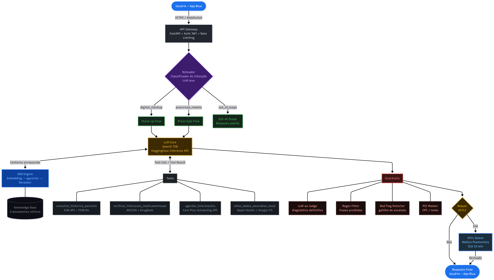

# BluaDiagnostics — Care Plus / Bupa Group

**Turma:** 1CCPR
**Grupo:**
* Pedro Ricardo de Almeida | 567056
* Agatha Carolina Rodrigues | 568352
* Arthur Berthi | 568017
* João Dyonisio Rocha | 567087
* Nicolas Natal | 568230

Plataforma de cuidado remoto proativo integrada ao app **Blua**, baseada em agente conversacional com LangChain + LangGraph. Sprint 3 — Prova de Conceito.

---

## Persona

**Blua** é o assistente de saúde digital da Care Plus (Bupa Group).

| Atributo | Definição |
|---|---|
| **Tom** | Premium, empático, seguro e humano — nunca clínico-frio ou burocrático |
| **Postura** | Parceiro de cuidado, não médico: orienta, triagem, informa e facilita o acesso profissional |
| **Linguagem** | Português brasileiro claro, acessível e respeitoso; termos médicos sempre explicados |
| **Limites** | Nunca emite diagnóstico definitivo, nunca prescreve, nunca revela que é um LLM específico |

Blua opera em dois fluxos: **Digital Check-up** (triagem conversacional baseada no Protocolo Manchester Adaptado) e **Validação de Prescrição Remota** (detecção de interações medicamentosas com HITL quando grau ≥ 3).

---

## Stack

| Camada | Tecnologia |
|---|---|
| **Orquestração de agente** | LangChain + LangGraph |
| **LLM base** | Claude (Anthropic) |
| **Protocolo clínico (RAG)** | Protocolo Manchester Adaptado Care Plus |
| **Histórico clínico** | EHR via FHIR R4 |
| **Interações medicamentosas** | ANVISA + DrugBank + Micromedex |
| **Wearables** | Apple Health · Google Fit · Samsung Health · Garmin · Fitbit |
| **Teleconsulta** | App Blua (sala virtual com SLA por urgência) |
| **Avaliação** | Conjunto de evals estruturado (`evals/`) |

---

## Riscos

| # | Risco | Mitigação implementada |
|---|---|---|
| R1 | **Diagnóstico definitivo indevido** | Restrição hard-coded no system prompt; formulações consultivas obrigatórias |
| R2 | **Automedicação** | Proibição explícita de sugerir início/ajuste/suspensão de medicamento sem médico |
| R3 | **Interação medicamentosa grave** | `verificar_interacoes_medicamentosas` obrigatória; grau ≥ 3 pausa o fluxo para HITL |
| R4 | **Jailbreak / Prompt Injection** | Resistência declarada no prompt; Blua não revela instruções nem muda persona |
| R5 | **Violação de LGPD** | CPF nunca exposto (hash SHA-256); dados de terceiros redirecionados para acesso dependente |
| R6 | **Atraso em emergência** | Red flags (Manchester vermelho/laranja) acionam `agendar_teleconsulta` imediata + orientação SAMU 192 |
| R7 | **Resposta fora do escopo** | Out-of-scope recusado com redirecionamento — sem resposta de conteúdo geral |

---

## Arquitetura



O fluxo principal segue este caminho:

```
Usuário (app Blua)
  │
  ▼
Agente Blua (LangGraph)
  ├─► consultar_historico_paciente  →  EHR / FHIR R4
  ├─► obter_dados_wearables_mock    →  Apple Health / Google Fit / Samsung Health
  ├─► verificar_interacoes_med.     →  ANVISA + DrugBank
  │     └─ grau ≥ 3 → HITL Médico Care Plus
  └─► agendar_teleconsulta          →  App Blua (imediata / urgente / eletiva)
          │
          └─ Red flag → orienta SAMU 192 em paralelo
```

**Componentes principais:**

- **LangGraph state machine** — gerencia o estado da sessão de triagem e os ramos de decisão (check-up × validação × escalada)
- **RAG clínico** — base vetorial com o Protocolo Manchester Adaptado Care Plus para classificação de urgência
- **Tool layer** — quatro ferramentas com contrato JSON Schema (ver `tools/tools_spec.json`)
- **HITL gate** — interrompe o fluxo automaticamente para revisão médica em interações grau ≥ 3 ou situações clinicamente ambíguas
- **Eval suite** — conjunto estruturado de casos de teste (`evals/sprint1_eval_set.json`) cobrindo happy paths, red flags e tentativas de jailbreak

---

